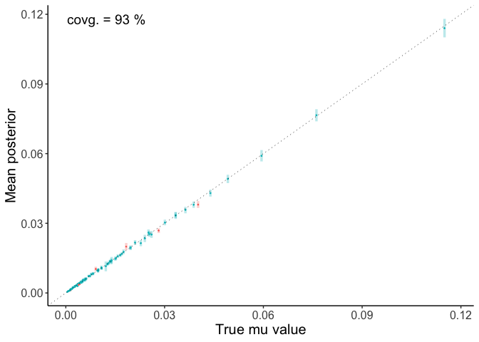
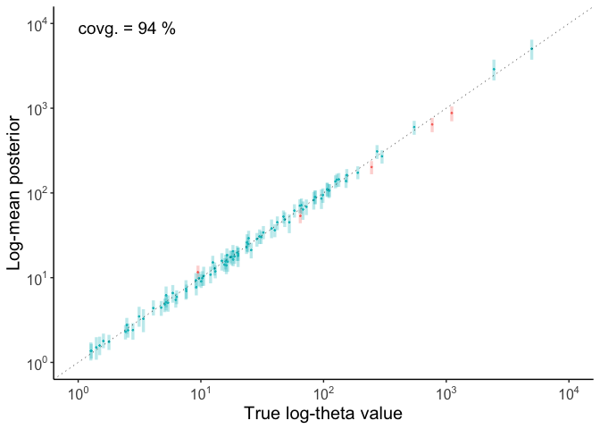

5-Step Pipeline to Summarise Coverage Tests
================
Walter Xie

The coverage-test pipeline included in the R package
[TraceR](https://github.com/walterxie/TraceR) provides some
post-analysis methods and visualisations for the results of validating
Bayesian phylogenetic models. These results can be generated using
[LPhyBEAST](https://github.com/LinguaPhylo/LPhyBeast) and
[BEAST 2](https://www.beast2.org)

## Installation

You can either use the **devtools** *install\_github()* function to
install the latest development version directly from the GitHub, or
install a particular version from the released source `TraceR_*.tar.gz`.
*remove.packages()* will make sure to clean the previous installed
version.

``` r
library("devtools")
remove.packages("TraceR")
devtools::install_github("walterxie/TraceR")
```

## Preparations

The input files for this pipeline are:

  - BEAST logs (tree logs) containing samples from the posterior,
  - and LPhy logs (tree logs) containing true values.

The example log files are available to download from
[here](https://github.com/LinguaPhylo/linguaPhylo.github.io/tree/master/covgtest).
You need to extract them into the same working directory, for example,
using the Linux command `ls *.gz |xargs -n1 tar -xzf`.

In this example, I set my working directory to
`~/WorkSpace/TraceR/examples/covgtest/`.

Then, check if all logs are ready. The files whose names satisfy with
pattern `_([0-9]+).log` are BEAST 2 logs, ones with `_([0-9]+)_true.log`
are LPhy simulation logs containing true values, and ones with
`_([0-9]+)_true.trees` are true trees from LPhy’s simulation. Do the
same to check true values and trees. But we do not need to procees any
BEAST tree logs here.

``` r
log.files = list.files(pattern = "_([0-9]+).log")
stopifnot(length(log.files)>100)
cat("Find", length(log.files), "logs, they are : ", paste(log.files[1:5], collapse = ", "), 
    " ... ", paste(log.files[109:110], collapse = ", "), ".\n")
```

    ## Find 110 logs, they are :  al2_0.log, al2_1.log, al2_10.log, al2_100.log, al2_101.log  ...  al2_98.log, al2_99.log .

``` r
tru.log.files = list.files(pattern = "_([0-9]+)_true.log")
stopifnot(length(tru.log.files)>100)
tru.tree.files = list.files(pattern = "_([0-9]+)_true.trees")
stopifnot(length(tru.tree.files)>100)
```

As you can see, there are 110 simulations in total, where 10 extra
simulations will be used for replacing any low ESS results. This keeps
the number of selected valid results (ESS \>= 200) as 100.

## Step 1: summarising traces

We summarise traces statistics for every BEAST logs. Here, we do not use
BEAST tree logs, because we have logged the total tree branch lengths
and root height in the BEAST
    logs.

``` r
library("tidyverse")
```

    ## Warning: replacing previous import 'vctrs::data_frame' by 'tibble::data_frame'
    ## when loading 'dplyr'

``` r
library("TraceR")

# Step 1
all.beast.params <- pipCreateSimulationSummaries(log.files, burn.in=0.1)
```

This generates a tsv file for each simulation.

``` r
all.stats = list.files(pattern = "_([0-9]+).tsv")
cat("Find", length(all.stats), "summaries, they are : ", 
    paste(all.stats[1:5], collapse = ", "), " ... ", 
    paste(all.stats[109:110], collapse = ", "), ".\n")
```

    ## Find 113 summaries, they are :  al2_0.tsv, al2_1.tsv, al2_10.tsv, al2_100.tsv, al2_101.tsv  ...  al2_98.tsv, al2_99.tsv .

The tsv file contains all BEAST parameters in columns, and statistics in
rows. But the 1st column “trace” is added by the pipeline and reserved
for the names of
    statistics.

``` r
all.beast.params
```

    ##  [1] "trace"                "posterior"            "likelihood"          
    ##  [4] "prior"                "pi_0.A"               "pi_0.C"              
    ##  [7] "pi_0.G"               "pi_0.T"               "pi_1.A"              
    ## [10] "pi_1.C"               "pi_1.G"               "pi_1.T"              
    ## [13] "pi_2.A"               "pi_2.C"               "pi_2.G"              
    ## [16] "pi_2.T"               "kappa.1"              "kappa.2"             
    ## [19] "kappa.3"              "r_0"                  "r_1"                 
    ## [22] "r_2"                  "mu"                   "Theta"               
    ## [25] "psi.height"           "psi.treeLength"       "sim_0.treeLikelihood"
    ## [28] "sim_1.treeLikelihood" "sim_2.treeLikelihood"

Furthermore, we may decide not to analyse every parameters, so the
selected parameters are:

``` r
# params to report
beast.params = c("mu","Theta", "r_0", "r_1", "r_2",
                 "kappa.1", "kappa.2", "kappa.3",
                 "pi_0.A", "pi_0.C", "pi_0.G", "pi_0.T",
                 "pi_1.A", "pi_1.C", "pi_1.G", "pi_1.T",
                 "pi_2.A", "pi_2.C", "pi_2.G", "pi_2.T",
                 "psi.treeLength", "psi.height")
```

The *psi.treeLength* represents the total branch length of each of
sampled trees, and *psi.height* is the root height.

## Step 2: selecting valid results

We need to select 100 results where the ESS of every parameters are  
guaranteed \>= 200 in this step.

We start from the first 100, and check ESS. If any ESS is not enough,
then replace the result to the one from the extra 10, and check ESS
again. Repeat this, until all ESSs \>= 200.

If all extra 10 are used but there still exists any low-ESS simulations,
then the pipeline will stop and inform to re-run all simulations with
longer MCMC chain length.

`i.sta=0`, `i.end=99` and `prefix="al2"` together determine the tsv file
names, such as `al2_0.tsv`, to start the first 100 inputs.

``` r
# Step 2
sele.list <- pipSelectValidResults(i.sta=0, i.end=99, prefix="al2", extra.tree.file.fun=NA)
```

If any extras are used, it will create “low-ESS.tsv” to record the
replacements.

``` r
fn = "low-ESS.tsv"
if (file.exists(fn))
  read_tsv(fn, col_types = cols())
```

    ## # A tibble: 4 x 3
    ##   origin minESS replace
    ##   <chr>   <dbl> <chr>  
    ## 1 al2_7   188.  al2_100
    ## 2 al2_32  172.  al2_101
    ## 3 al2_76  163.  al2_102
    ## 4 al2_88   34.0 al2_103

## Step 3: summarising parameters

We combine and summarise the selected 100 results for each of selected
BEAST parameters.

``` r
summ <- pipCreateParameterSummaries(sele.list, params = beast.params)
```

The summary result of “mu”:

``` r
summ$param.summaries[["mu"]][1:3,]
```

    ## # A tibble: 3 x 6
    ##   simulation mean         HPD95.lower     HPD95.upper     stdev       ESS       
    ##   <chr>      <chr>        <chr>           <chr>           <chr>       <chr>     
    ## 1 al2_0      0.016271938… 0.015475280896… 0.017030694937… 0.00040945… 1293.2697…
    ## 2 al2_1      0.001431022… 0.001266143550… 0.001606551531… 8.61840931… 762.39814…
    ## 3 al2_10     0.001182678… 0.001007519281… 0.001371526129… 9.34919451… 1306.5272…

## Step 4

This creates one final summary file containing true values for every
parameters.

LPhy may use different variable names to BEAST 2 parameters, so we need
to provide their names in the same order of given BEAST 2 parameters in
the step 1:

``` r
# the order of parameters same to BEAST parameters
lphy.params = c("μ","Θ","r_0","r_1","r_2","κ_0","κ_1","κ_2",
                "π_0_0","π_0_1","π_0_2","π_0_3",
                "π_1_0","π_1_1","π_1_2","π_1_3",
                "π_2_0","π_2_1","π_2_2","π_2_3")
```

The `add.tree.stats=TRUE` will start to summarise statistics from the
true tree, which are fixed to “total.br.len” (total branch length) and
“tree.height” at the moment.

``` r
# Step 4
df.tru <- pipCreateTrueValueSummaries(names(sele.list), params=lphy.params, add.tree.stats=TRUE)
```

``` r
df.tru[1:3,]
```

    ## # A tibble: 3 x 23
    ##   simulation       μ     Θ   r_0    r_1   r_2   κ_0   κ_1   κ_2  π_0_0 π_0_1
    ##   <chr>        <dbl> <dbl> <dbl>  <dbl> <dbl> <dbl> <dbl> <dbl>  <dbl> <dbl>
    ## 1 al2_0      0.0165   18.3 0.875 1.36   0.764 2.31   2.54  3.92 0.179  0.470
    ## 2 al2_1      0.00145  72.4 0.720 0.286  1.99  3.82   1.71  1.69 0.260  0.123
    ## 3 al2_10     0.00143  23.8 1.81  0.0473 1.14  0.676  1.68  6.72 0.0644 0.147
    ## # … with 12 more variables: π_0_2 <dbl>, π_0_3 <dbl>, π_1_0 <dbl>, π_1_1 <dbl>,
    ## #   π_1_2 <dbl>, π_1_3 <dbl>, π_2_0 <dbl>, π_2_1 <dbl>, π_2_2 <dbl>,
    ## #   π_2_3 <dbl>, total.br.len <dbl>, tree.height <dbl>

## Step 5

This marks how many true values are falling into or outside the 95% HPD
interval of posteriors for each parameter, and return the overall
coverage in a data frame.

Note: the same parameter may be given different names between LPhy
script and BEAST XML/log, please ensure that you match them correctly.

``` r
# Step 5
covg <- reportCoverages(beast.params = beast.params,
                        lphy.params = c(lphy.params, "total.br.len","tree.height"))
```

``` r
covg[1:5,]
```

    ## # A tibble: 5 x 3
    ##   lphy  beast  covg
    ##   <chr> <chr> <dbl>
    ## 1 μ     mu     0.93
    ## 2 Θ     Theta  0.94
    ## 3 r_0   r_0    0.96
    ## 4 r_1   r_1    0.94
    ## 5 r_2   r_2    0.98

## Plots

The files "\*-coverage.tsv" contains the coverage calculations for each
parameter.

``` r
covg.files = list.files(pattern = "-coverage.tsv")
stopifnot(length(covg.files)>0)
```

The coverage of “mu”:

``` r
inOut <- read_tsv("mu-coverage.tsv", col_types = cols())
ggCoverage(inOut, x.lab="True mu value")
```

<!-- -->

Sometime, the log-scale is required:

``` r
inOut <- read_tsv("Theta-coverage.tsv", col_types = cols())
p <- ggCoverage(inOut, x.lab=paste0("True log-theta value"),
                y.lab="Log-mean posterior", x.txt=1, y.txt=9000)
# log scale and fix labels and text
p + scale_x_log10(limits = c(1,1e4), breaks = scales::trans_breaks("log10", function(x) 10^x),
                  labels = scales::trans_format("log10", scales::math_format(10^.x))) +
    scale_y_log10(limits = c(1,1e4), breaks = scales::trans_breaks("log10", function(x) 10^x),
                  labels = scales::trans_format("log10", scales::math_format(10^.x)))
```

<!-- -->

## Citation

Drummond AJ, Xie D, Mendes F (), LinguaPhylo: a probabilistic model
specification language for reproducible phylogenetic analyses, in
preparation.
